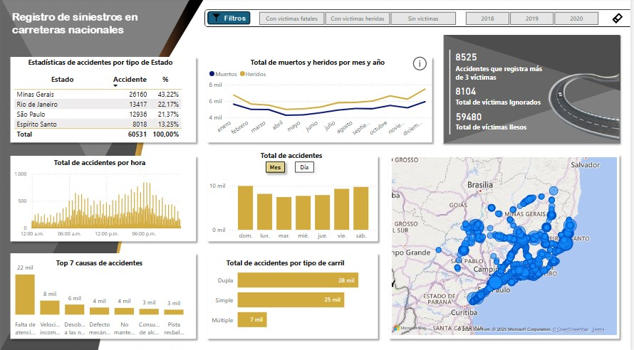

# Registro de siniestros en carreteras nacionales

Análisis de Accidentes de Tráfico.

Introducción
El análisis de accidentes de tráfico en Brasil revela patrones preocupantes, especialmente en el estado de Minas Gerais, que se destaca por tener la mayor cantidad de accidentes en comparación con otros estados como Río de Janeiro, São Paulo y Espírito Santo. Este informe busca identificar las causas subyacentes de esta problemática y proponer recomendaciones para mejorar la seguridad vial.

Comparativa de Accidentes por Estado
En total, se registraron 60,531 accidentes en los estados analizados. La distribución es la siguiente:
• Minas Gerais: 26,160 accidentes (43.22%)
• Río de Janeiro: 13,417 accidentes (22.17%)
• São Paulo: 12,936 accidentes (21.37%)
• Espírito Santo: 8,018 accidentes (13.25%)

Minas Gerais no solo lidera en número absoluto de accidentes, sino que también presenta un porcentaje significativamente mayor que el resto de los estados, lo que lo convierte en un estado crítico en términos de seguridad vial.

Identificación de Causas
El análisis de las causas de los accidentes en Minas Gerais sugiere varios factores que podrían estar contribuyendo a esta alta tasa de siniestralidad:
• Factores Geográficos y Viales:
Densidad de Población y Tráfico: Minas Gerais cuenta con áreas urbanas densas que incrementan el número de vehículos en circulación.
Condiciones de las Vías: La infraestructura vial puede estar deteriorada, lo que aumenta el riesgo de accidentes.
• Comportamientos del Conductor:
Según el análisis del gráfico "Top 7 Causas de Accidentes", la principal causa de siniestralidad es la falta de atención por parte de los conductores. Esta se encuentra seguida por el exceso de velocidad, donde los vehículos circulan a velocidades superiores a los límites establecidos. Además, se destacan comportamientos irresponsables, como el consumo de alcohol y la distracción, que son especialmente prevalentes durante los fines de semana y contribuyen significativamente a la siniestralidad en las carreteras.
• Factores Económicos:
Inversión en Seguridad Vial: Minas Gerais podría estar recibiendo menos inversión en educación vial y campañas de seguridad en comparación con estados como São Paulo.
• Tipo de Transporte:
Transporte de Carga: La actividad minera en el estado genera un alto volumen de vehículos de carga, aumentando la probabilidad de accidentes.
• Turismo: 
La BR-050 es una carretera federal radial brasileña. Su punto de partida es en Brasilia y el final en Santos. Pasa por los estados de Goiás, Minas Gerais y São Paulo. Es considerada como una de las carreteras más transitadas del país, ya que conecta la capital federal con la metrópoli brasileña más grande, São Paulo.​

Análisis Temporal
Los datos muestran que los meses de enero y diciembre presentan un aumento en la cantidad de accidentes, posiblemente debido a las festividades y el incremento del tráfico por temporada vacacional. Además, se identifican patrones de accidentes más frecuentes entre las 5:00 y 6:30 de la tarde, así como durante los fines de semana, lo que sugiere un aumento en la actividad vehicular y el consumo de alcohol.
Verificando el clima en el estado de Minas Gerais en los meses dichos anteriormente se observa:
• Estación: Verano
• Temperaturas: 
Diciembre:
Rango de 18°C a 30°C.
Enero: Rango similar, con máximas que pueden llegar hasta 32°C.
• Precipitaciones:
Diciembre:
Mes de alta pluviosidad. Se esperan lluvias frecuentes, especialmente en la segunda mitad del mes.
Enero:
Continuación de la temporada de lluvias, también con precipitaciones abundantes, mayormente en forma de tormentas.
La causa del aumento de vehículos puede deberse a altas temperaturas o lluvias intensas.

Causas de Accidentes
El análisis de las causas de los accidentes revela que la falta de atención por parte de los conductores es la principal causa, seguida por el exceso de velocidad y la desobediencia a las normas de tránsito. En total, se registraron:
• 22,000 accidentes por falta de atención.
• 8,000 accidentes por exceso de velocidad.
• 6,000 accidentes por desobediencia a las normas.

Análisis del Tipo de Carril
La distribución de accidentes por tipo de carril también es relevante:
• Carril Doble: 28 mil accidentes (mayor número de accidentes, posiblemente debido a una mayor exposición al tráfico y menor percepción de velocidad).
• Carril Simple: 25mil accidentes (similar al carril doble, pero puede estar relacionado con decisiones peligrosas debido a la proximidad del tráfico).
• Carril Múltiple: 7mil accidentes (menor número total, lo que sugiere características de seguridad que lo hacen menos propenso a ciertos tipos de accidentes).

Comparativa Anual
El análisis de los accidentes ocurridos entre 2018 y 2019 revela patrones significativos en la frecuencia de incidentes a lo largo del día. Se observa que la mayor cantidad de accidentes, así como de muertos y heridos, incrementa a partir de las 4:00 PM, con una disminución notable durante la noche. Este hallazgo sugiere que las horas pico de tráfico y actividad vehicular son momentos críticos para la seguridad vial.
En cuanto a la distribución mensual de los accidentes, mayo y diciembre se destacan como los meses con el mayor número de incidentes registrados. Por otro lado, marzo se identifica como el mes con la menor cantidad de accidentes, lo que podría indicar una menor actividad vehicular o condiciones más favorables en ese período.
Un aspecto positivo que se puede destacar en este análisis es que la cantidad de heridos es significativamente mayor que la de muertos. Esto sugiere que, aunque los accidentes son frecuentes, las medidas de seguridad y atención médica pueden estar funcionando adecuadamente para reducir la gravedad de las lesiones, lo que es un indicativo alentador en el contexto de la seguridad vial. El número de las victimas resultaron ilesas en su mayoría con un total de 21.578 personas en el año 2018, 20.023 en 2019 y 17.879 en 2020.

Examinando el total de muertos y heridos por mes para identificar meses críticos, notamos que en el mes de octubre entre los años 2019 y 2020, Minas Gerais registró 17094 accidentes, constituyendo el 43.02% del total de accidentes documentados en los estados mencionados.
Estos accidentes llevaron a tener 8.353 accidentes donde se registraron 3.749 Muertos y 4.604 heridos, dejando 37.902 víctimas ilesas y 5.593 ignorados . Este porcentaje es notablemente superior al de otros estados, como Río de Janeiro (22.25%), São Paulo (21.19%) y Espírito Santo (13.53%). 
Esta disparidad sugiere que existen problemas específicos en las condiciones de tránsito, la infraestructura y el comportamiento de los conductores en Minas Gerais, además de otros factores posibles como: condiciones climatológicas, octubre es un mes donde puede haber cambios climáticos que afectan la visibilidad y las condiciones de la carretera.
Eventos y festividades, puede haber un aumento en el tráfico asociado a festividades locales o eventos que requieren desplazamientos masivos.
Incremento en la movilidad, la finalización de ciertos ciclos escolares o el inicio de vacaciones puede generar un aumento en la movilidad y, por ende, en los accidentes.
Estado de las vías, la infraestructura vial puede estar deteriorada y requerir mantenimiento, particularmente después de la temporada de lluvias más intensas, que suelen ocurrir en otras épocas del año.

Al analizar los datos de accidentes, muertos y heridos entre los años 2018, 2019 y 2020, se destaca que el estado de Espírito Santo es el más seguro, con el menor número de accidentes registrados. Este descenso en la siniestralidad podría estar relacionado con mejoras en la infraestructura vial y la implementación de campañas de concienciación sobre seguridad. Sin embargo, es importante señalar que, al igual que en otros estados, también se observa un incremento en los accidentes durante ciertos meses y horarios.
Un análisis geográfico revela que hay áreas específicas con una alta concentración de accidentes, como la ciudad de Serra. Conocida por sus playas limpias, su agroturismo y su polo industrial, Serra presenta características que podrían contribuir a la siniestralidad. Las causas previamente identificadas para el estado de Minas Gerais, como la falta de atención al conducir y el aumento del tráfico, son igualmente aplicables en este contexto, lo que sugiere que se requieren medidas adicionales para abordar estos desafíos en la ciudad.

Conclusión
El análisis de los accidentes de tráfico revela patrones preocupantes, especialmente durante los fines de semana y en ciertos horarios. La identificación de las causas subyacentes y la implementación de medidas adecuadas son esenciales para mejorar la seguridad vial y reducir la siniestralidad en la región. La colaboración entre autoridades, comunidades y conductores es fundamental para lograr un cambio positivo.

Recomendaciones
• Mejora de la Infraestructura Vial: Invertir en el mantenimiento y mejora de las carreteras para reducir riesgos.
• Campañas de Conciencia Vial: Implementar programas educativos que promuevan la conducción responsable, especialmente en meses críticos.
• Monitoreo y Análisis Continuo: Establecer sistemas de monitoreo para identificar tendencias y patrones de accidentes, permitiendo una respuesta más informada.
